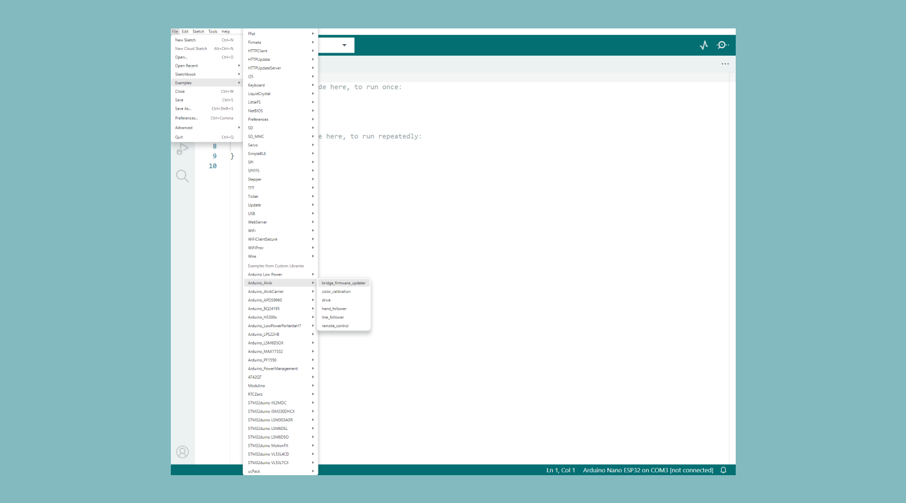
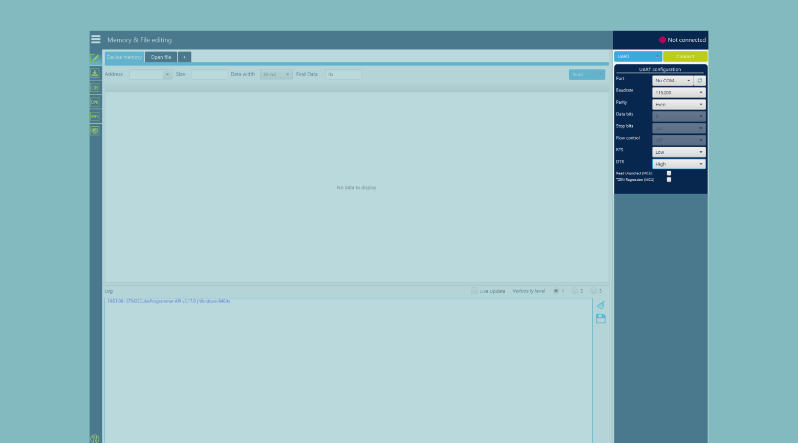
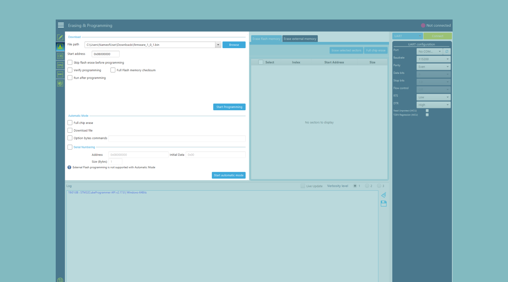

# Arduino_Alvik
Arduino Alvik library, code your Alvik

  

To use this library, you need an [Arduino® Alvik](https://store.arduino.cc/pages/alvik) robot.

Once the Arduino® Nano ESP32 of the robot is attached to the computer, select `Arduino Nano ESP32` from Arduino IDE 2 to program it.

 

## Color Calibration

Flash `color_calibration` sketch into Arduino Nano ESP32 mounted on Alvik and follow the instructions on serial monitor.

The white and black values will be written into ESP32 EEPROM. 

 

## How to update firmware of Arduino Alvik Carrier

Since this [issue](https://github.com/stm32duino/Arduino_Core_STM32/issues/2292), Arduino® Alvik Carrier is not integrated yet into STM32duino's boards.

 
At the moment, it is possible to:

- Open the **Bridge** example in the Arduino IDE by going to **File > Examples > Arduino_Alvik > bridge_firmware_updater**. (For this, the board's [firmware must be reset](https://support.arduino.cc/hc/en-us/articles/9810414060188-Reset-the-Arduino-bootloader-on-the-Nano-ESP32) to work in the Arduino IDE.)

- Open [STM32 Cube Programmer](https://www.st.com/en/development-tools/stm32cubeprog.html).
- Set the connection to **UART** mode, the **Port** to whichever port the board is connected to, and **DTR** to HIGH. You can now press **Connect**. Make sure the robot is ON.

- Go to the **Erasing & Programming** tab and set the **File path** to the firmware (this will be a .bin file) you are trying to program. The updated releases can be found [here](https://github.com/arduino-libraries/Arduino_Alvik/releases/). You can find the latest release [here](https://github.com/arduino-libraries/Arduino_Alvik/releases/tag/1.0.1). You can now press **Start Programming**.

 

## Useful links
- [arduino-alvik-mpy](https://github.com/arduino/arduino-alvik-mpy): MicroPython library required to program Alvik
- [Arduino_AlvikCarrier](https://github.com/arduino-libraries/Arduino_AlvikCarrier): Arduino library required to build the firmware
- [Arduino Alvik product page](https://store.arduino.cc/pages/alvik)
